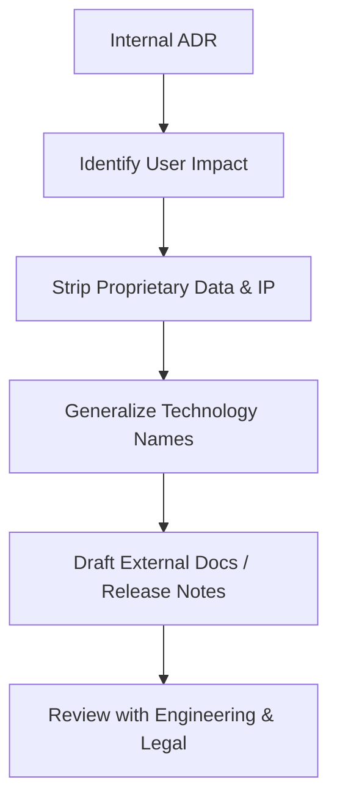

# Playbook: Translating ADRs to External Help Documentation

Internal Architecture Decision Records (ADRs) capture critical engineering decisions. However, they cannot be shared with external users or partners directly due to **Intellectual Property (IP) boundaries** and technical complexity. 

This playbook outlines how a Senior Technical Writer translates internal ADRs into user-facing content (like release notes, migration guides, and developer portals) while maintaining strict IP hygiene.

---

## The Translation Process

### 1. Identify User Impact
Analyze the ADR to answer:
- **Does this change client-side behavior?** (e.g., changing endpoints, headers, authentication steps).
- **Does this affect performance, billing, or rate-limiting?**
- **Is action required from the user?** (e.g., updating client libraries, rotating keys).

### 2. Strip Proprietary Data & IP
Ensure the external document contains **zero** instances of:
- Internal server names, hostnames, or IP addresses (e.g., `prod-db-cluster-01`).
- Proprietary library names, internal tools, or employee names.
- Exact database tables, storage directories, or system security keys.

### 3. Generalize Technology Names
If the decision mentions a highly specific proprietary tool, generalize it to the industry standard protocol:
- *Internal ADR:* "Migrating customer metrics storage from internal-cassandra-v4 cluster to Google Bigtable."
- *External translation:* "Migrating our metrics repository to a highly scalable, distributed columnar store to improve query performance by 40%."

### 4. Create Fictionalized Examples for Verification
When showcasing these workflows to hiring managers or on portfolios, **never copy and paste actual company documents**. Instead, write a simplified, fictional scenario (like our JWT auth migration example) using standard public templates.

---

## Example Translation Mapping

| Internal ADR Element (Proprietary / Complex) | External Help Translation (Actionable / Safe) |
| :--- | :--- |
| **Decision:** Migrate billing services to AWS Lambda to reduce database lockups on `tb_subscriptions`. | **Update:** We are moving our subscription processing to a serverless architecture. This improves reliability during peak usage periods and eliminates billing transaction timeouts. |
| **Technical details:** JWT signatures will be verified using the local public key cached via Redis at `redis-cache.prod.internal:6379`. | **Developer Impact:** API validation is now stateless and signature-verified. Developers do not need to make any changes; standard response times will drop by ~25ms. |
